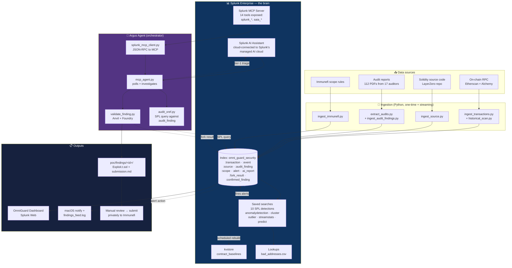
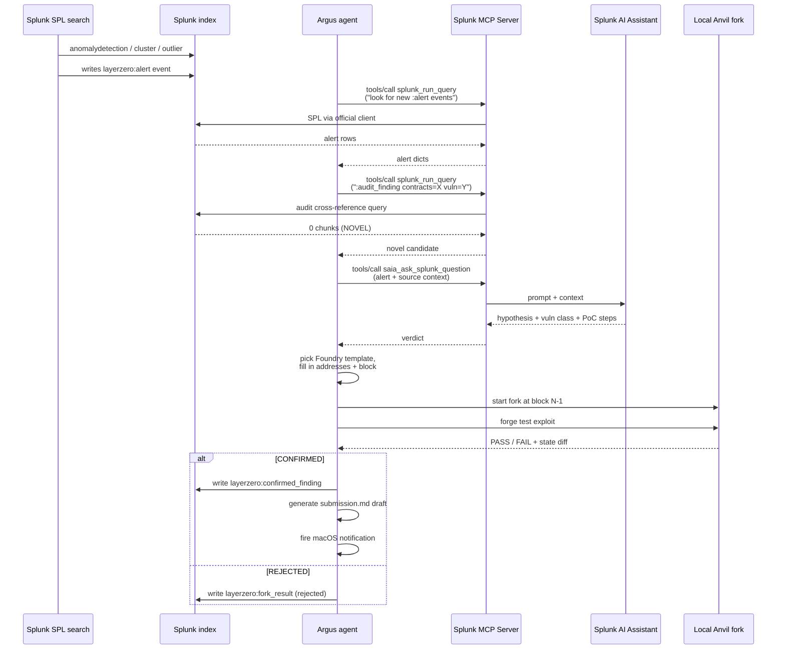

# Argus — Architecture

Splunk-native security operations platform for cross-chain DeFi protocols.
Every analysis layer leans on Splunk primitives; external code only fills
gaps Splunk doesn't natively cover (chain RPC ingestion, Anvil fork
validation).

## High-level

## The investigation loop (one alert)

## Splunk-native principles (what makes this "use Splunk correctly")

| Principle | How Argus implements it |
|---|---|
| Detection is data-driven, not threshold-driven | `eventstats avg/stdev by contract` → z-score → flag |
| SPL does the work, not Python | Agent only orchestrates; all analysis is SPL |
| Splunk index = state store | Investigations, fork results, confirmed findings all indexed |
| Lookups for enrichment | `bad_addresses.csv` joined on every tx |
| Saved searches drive scheduling | Cron-scheduled SPL → alert events → agent reacts |
| kvstore for structured state | `contract_baselines` rebuilt nightly |
| Sourcetypes typed by intent | 11 typed sourcetypes, props.conf declared |
| Agent should be dumb, Splunk is smart | Agent contains no detection logic — all SPL |

## Splunk apps used (12 total)

| App | Role |
|---|---|
| Splunk MCP Server (1.1.3) | Official MCP interface — 14 tools |
| Splunk AI Assistant (2.0.0) | Cloud-connected LLM tier (saia_* tools) |
| Splunk AI Toolkit (5.7.4) | ML-SPL commands (fit/apply, DBSCAN, etc.) |
| Python for Scientific Computing (4.3.2) | Runtime for AI Toolkit |
| Splunk AI Canvas (1.4.1) | AI workspace |
| Splunk Security Essentials (3.8.3) | Security pattern library |
| InfoSec App (1.7.1) | Security dashboards |
| Generic LLM Connector | Optional alternative LLM path |
| TA-Triage | `\| triage` SPL command |
| Slack Alerts (2.3.2) | Optional Slack notifications |
| OmniGuard Security Monitor | This project's app — searches + dashboard + lookups |
| Audit Trail (1.0.0) | Default Splunk audit log |

## External components (not Splunk)

- **Anvil** (Foundry) — local mainnet fork for ground-truth exploit validation
- **Etherscan + Alchemy** — chain data ingestion
- **Python ingestion scripts** — translate RPC responses into Splunk events

Everything else is Splunk.
