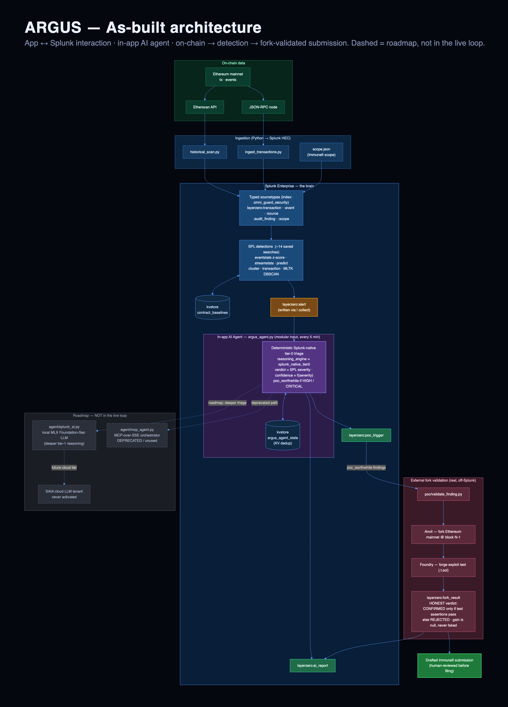
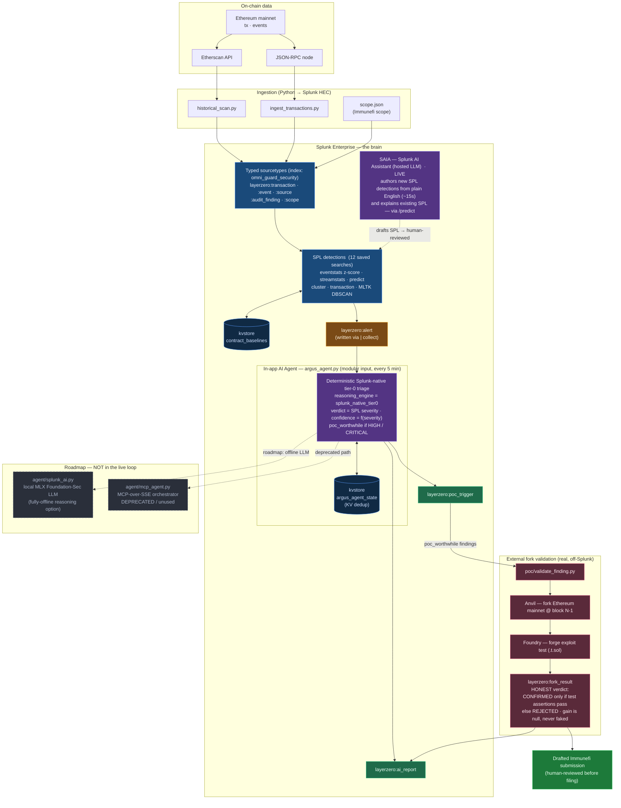
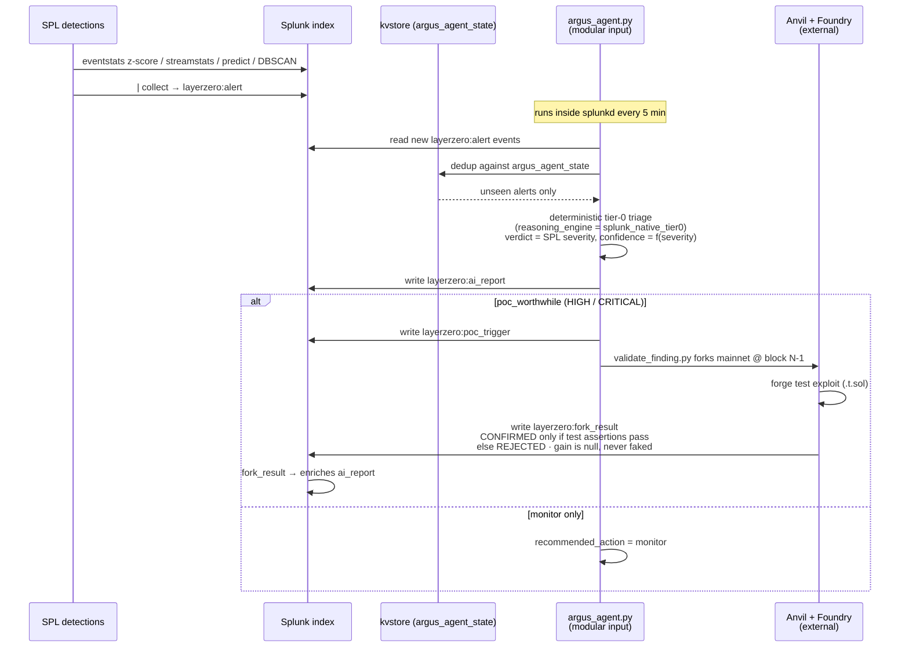

# Argus — Architecture

Splunk-native security operations platform for cross-chain DeFi protocols.
Every analysis layer leans on Splunk primitives; external code only fills
gaps Splunk doesn't natively cover (chain RPC ingestion, Anvil fork
validation). **The production AI runs on Splunk's own stack: deterministic
Splunk-native tier-0 triage produces the verdicts, and the Splunk AI Assistant
(SAIA) — Splunk's hosted LLM — authors and explains the SPL detections
themselves. (An experimental local MLX Qwen2.5 reasoning tier was trialed; its
outputs remain tagged in the index by `reasoning_engine` but are not the
production verdict path.)**

**Naming.** *Argus* is the product; *`omni_guard`* is its Splunk-native **engine**
(the app and the roads it runs on). Everything below — the `omni_guard_security`
index, the SPL detections, the KV store, the in-app agent, and the `| forkvalidate`
command — is the `omni_guard` app, with `TA-triage-v1` as the ingest/triage add-on.
The two names are intentional layers, not a rename in progress.

> The PNG above is rendered from the mermaid source below
> (`demo/render_diagram.js`). It depicts the **as-built** system. The
> purple **SAIA** node is the Splunk AI Assistant, **live** — it writes and
> explains SPL detections (invoked on demand). Dashed, greyed nodes are
> **roadmap — not wired into the live loop**.

## As-built data flow

## The live loop (one alert, as-built)

The in-app agent is a **Splunk modular input** (`splunk/bin/argus_agent.py`,
Splunk Python SDK) that runs inside `splunkd` every 5 minutes. Its triage is
**deterministic Splunk-native tier-0** — it does not call any LLM. The verdict
is the SPL detection severity, confidence is a function of severity, and a
finding is flagged `poc_worthwhile` when the severity is HIGH or CRITICAL.

> **SAIA as the SPL-authoring brain (LIVE, verified).** The **Splunk AI
> Assistant (SAIA)** — Splunk's own hosted LLM — **drafts brand-new SPL
> detections** from a plain-English threat description and **explains existing
> SPL**, via the SAIA `/predict` API (`agent/saia_generate_detection.py`;
> verified live this session: ~15s to write a scoped z-score detection that then
> executed and returned 306 rows). Output lands in `splunk/generated/` with a
> "review before scheduling" header — it is **human-reviewed before** it joins
> the live saved-search set, not auto-installed. The AI builds the security
> logic; a person approves it. Invoked on demand, not inside the 5-minute tick.
>
> **What SAIA does *not* reliably do (honest note).** A separate experiment
> (`agent/llm_enrich.py`) asks SAIA's free-form "tell me" mode to *judge* each
> finding. For this tenant that path is unreliable — it either deflects ("how
> does this relate to SPL?") or exceeds a 600s poll deadline; across 30 attempts
> only 1 returned a usable verdict. So finding-level verdicts come from the
> **deterministic Splunk-native tier-0** triage, **not** from SAIA. The enrich
> script now writes nothing on a non-answer (no fabricated verdict).
>
> **Roadmap (not in the live loop).** `agent/splunk_ai.py` hosts a local **MLX
> Foundation-Sec** model as a fully-offline reasoning option — not wired into the
> live loop. The old `agent/mcp_agent.py` (MCP-over-SSE orchestrator) is
> **deprecated/unused**. Neither runs in the shipped system.

## Splunk-native principles (what makes this "use Splunk correctly")

| Principle | How Argus implements it |
|---|---|
| Detection is data-driven, baselines auto-tune | `eventstats avg/stdev by contract` → z-score → flag, with conservative fixed floors (e.g. value_eth>0.1, zscore>3, fails_10m>5) to suppress dust/noise |
| SPL does the work, not Python | The agent only triages/orchestrates; all detection is SPL |
| Splunk index = state store | Alerts, AI reports, poc triggers, fork results all indexed |
| The agent lives inside Splunk | `argus_agent.py` is a modular input running in `splunkd` |
| Verdicts are deterministic | tier-0 verdict = SPL severity; the verdict path makes zero AI calls |
| Production AI is Splunk's own | SAIA (Splunk's hosted LLM) authors the detections; the local MLX Qwen2.5 reasoning tier was experimental — its outputs stay tagged in the index by `reasoning_engine`, but it is not the production verdict path |
| kvstore for structured state | `contract_baselines` (baselines) + `argus_agent_state` (dedup) |
| Sourcetypes typed by intent | typed `layerzero:*` sourcetypes, `props.conf` declared |
| Ground truth from a real fork | Anvil + Foundry; honest CONFIRMED/REJECTED, gain never faked |

## Sourcetypes (index: `omni_guard_security`)

| Sourcetype | Written by | Meaning |
|---|---|---|
| `layerzero:transaction` | ingestion | on-chain transactions |
| `layerzero:event` | ingestion | decoded contract events |
| `layerzero:source` | ingestion | Solidity source for in-scope contracts |
| `layerzero:audit_finding` | ingestion | known findings from audit reports |
| `layerzero:scope` | ingestion (`scope.json`) | Immunefi in-scope assets |
| `layerzero:alert` | SPL detections (`\| collect`) | anomaly fired by a saved search |
| `layerzero:ai_report` | `argus_agent.py` | tier-0 triage verdict |
| `layerzero:poc_trigger` | `argus_agent.py` | hand-off to fork validation |
| `layerzero:fork_result` | `validate_finding.py` | honest fork verdict |

## External components (not Splunk)

- **Anvil + Foundry** — local mainnet fork for ground-truth exploit validation
  (`poc/validate_finding.py`). Forks at block N-1, runs a `forge` exploit test,
  and only reports CONFIRMED when the test's own assertions pass.
- **Etherscan + JSON-RPC** — chain data ingestion.
- **Python ingestion scripts** — translate RPC/Etherscan responses into typed
  Splunk events over HEC.

Everything else — detection, triage state, the in-app agent — is Splunk.
